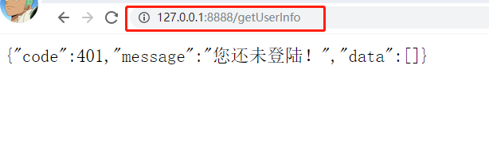
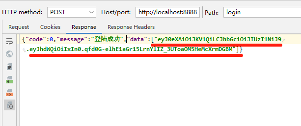
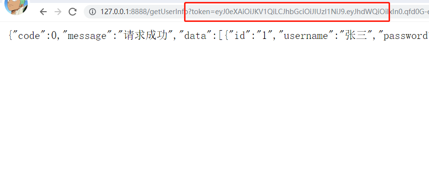

# sun-jwt
SpringBoot整合jwt完成的token登陆验证

### 自助链接
1. jwt 的 java api https://github.com/auth0/java-jwt
2.  JSON Web Token (JWT) https://tools.ietf.org/html/rfc7519
3. 10分钟了解JSON Web令牌（JWT） https://baijiahao.baidu.com/s?id=1608021814182894637&wfr=spider&for=pc


---

这个项目我自认为自己写的还算不错，算是一个比较完整的，可立即应用到业务上的轮子吧
很简洁，可谓是该有的都有了，分工明确


### 1. 介绍
这个项目只包含一个登陆与校验功能 <br>
我使用注解与切面的方式将模块分离出来，如果后面需要添加别的校验功能，直接再添加aop即可

如果一个方法需要认证后只需加一个注解即可
```java
@Authentication
public void test(){
    // test
}
```
如果一个类里面的所有方法都需要认证，也可以直接将`@Authentication`加在类上

### 2. 完成功能
1. 登陆，创建token
2. 退出功能
3. token自定义有效期（在 com.sixsixsix516.sunjwt.config.TokenConfig.DEFAULT_FAILURE_TIME 可配置）
4. 同一账号只能一个人操作（一个账号的token只存在一份）


### 3. 使用方法
- 导入sql（resources/sunjwt.sql）
- 启动redis

然后启动程序 com.sixsixsix516.sunjwt.SunJwtApplication.main

> 为了测试方便，我将大部分接口全改为GET方式
1. 访问 /getUserInfo,可见不通过

2. 接下来，登陆一下拿到token

3. 再次访问，发现以通过验证


在 com.sixsixsix516.sunjwt.controller 下的方法每个都可以无脑测
